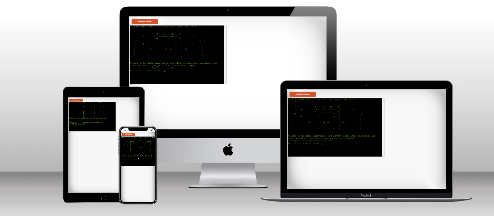
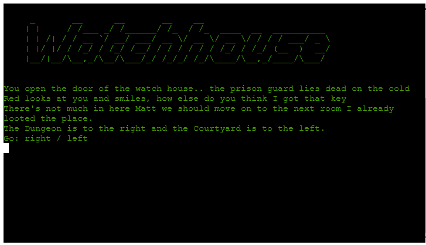
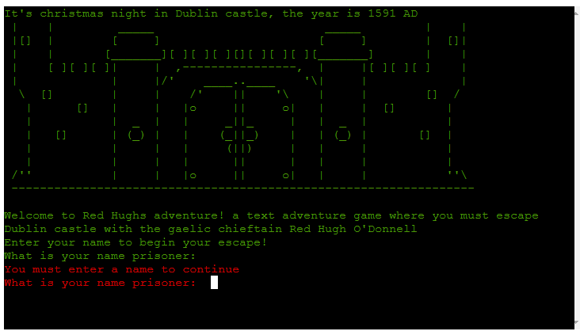

# Red Hugh's Adventure

Red Hugh's Adventure is a Python terminal adventure game which runs in the Code Institute's mock terminal on Heroku.

Players must navigate their way through Dublin castle and escape through an exit while solving puzzles along the way. 

You can find the live site [Here](https://red-hughs-adventure.herokuapp.com/).
####

&nbsp;

# Purpose
I built this website as my third project for the code institutes full stack development and e-commerce applications course. 
I built this website from scratch using the knowledge I gained from the course where I studied the basics of Python.

## How to play
* This game is constructed like a traditional text adventure game where the player is asked to input what direction they would like to head. 

* For example head north for kitchen, head south for bedroom and head east for bathroom.

* Once the desired input is entered the player will arrive there and be allowed to return to previous locations with items picked up from other ones.

* Items acquired through visiting new locations and solving puzzles are vital to the player's progress and will allow he/she to escape and complete the game. 

* If a player is caught or killed by the guards they will fail the game and be offered another attempt. 

## Features 

1.  The game features 10 different rooms / areas to explore some are possible to return to while others such as the area you began in, are not.

Different Areas

 

2.  The player is given multiple choices to explore a different direction in each room / area they venture into. 

3. The game accepts user input to add their name, which is referenced throughout and to move direction and tells the player to enter which word to go which direction. 

Multiple choices for navigation

 

4. User input can also determine whether the player wants to undertake a certain task or pick up an object. 

Choice of task

 

5. Validation is implemented on every choice the player can make, if a player enters something other than the game requested, they will be met with text that is coloured red to tell them the only options they can enter to proceed. 

Input validation

 

6. If the player is caught or killed by the guards he will lose, the game will then offer them another chance to play again or to exit the game entirely. 

Game over

 

7. The delay print function makes the text print out slowly as if it is just appearing on screen one letter at a time mimicking text adventure games which were popular in the 1980's.

8. The text's green color is also chosen to make the game seem like a terminal adventure game from the past, it gives the game a retro and authentic feel.

9. To differentiate between each room unique ASCII art is loaded on entering giving the game a better design. 

10. A progress bar which simulates a new area rendering is added to the bottom of each area when the player inputs which direction he would like to go. 

Loading area bar

 

## Future Features 

* An OOP combat system when facing the guards 
* Allow players to interact with their fellow prisoner Red Hugh and find out more about him. 
 

# Design 

## Issues with design

* Orginally each areas script and ASCII art was loaded with a simple print function but this proved to be too messy and left the code readability very poor along with making it very hard to maintain. I then created two dictionaries to pull the scripts and images from. 
 

* To keep the player from having to enter the intro section and have to read the script once again I removed it after the intro sequence was done. Bypassing the intro and having them go straight from the courtyard to the dungeon and vice versa. 
 

* To save me printing out the script and image to be loaded in each scene I created the display_scene() function in which I could pass the dictionary key's in as parameters, making my code even more readable and easier to maintain. 

# Bugs 

* Originally was getting errors in the Heroku Terminal as I had not added Textualize rich and Colorama to the requirements.txt file, adding them to the file quickly fixed this. 
 

* The game would load the return from the castle gates with no key function even when the player had pickpocketed the key successfully, I soon realized I had not initialized the key as a global variable. 
 

* No bugs remained after this. 
 

# User stories

## First time stories 
* As a first time user: I want to be able to know how to play the game 
Testing done to make sure that game instructions on how to navigate to each room display in the terminal  

First time user 1

| **Feature** | **Action** | **Expected Result** | **Actual Result** |
|-------------|------------|---------------------|-------------------|
|Game directions | Check Direction options appear in the python terminal | Directions load at end of each scene giving you option to move on to next area or go back the way you came  | Works as expected |

 
 

* As a first time user: I want to be able to navigate through the game.   
 Testing done to ensure that the game is fully functional.

First time user 2

| **Feature** | **Action** | **Expected Result** | **Actual Result** |
|-------------|------------|---------------------|-------------------|
| Game Directions | Check that each direction you enter brings you to the said location | The player moves on to the expected room they entered the direction for and it appears in the "you chose to enter: " line | Works as expected |

 
 

* As a first time user: I want to be able to input my name in the Game 
 Testing done to ensure that the players Name is asked upon the game's start.

First time user 3

| **Feature** | **Action** | **Expected Result** | **Actual Result** |
|-------------|------------|---------------------|-------------------|
|Name input | Load up the game in the Heroku terminal, on the title screen it will ask the player to input their name | The game will welcome you with your name | Works as expected |

 
 

* As a first time user: I want to be able to re-enter my name if I typed nothing and pressed enter by mistake  
 Testing done to ensure that when the game will not commence unless the player has entered a name.

First time user 4

| **Feature** | **Action** | **Expected Result** | **Actual Result** |
|-------------|------------|---------------------|-------------------|
|Name input |The player must enter a name for the game to commence  | With no name entered the gane will not commence, the terminal will ask the player for their name again until they enter something | Works as expected |

 
 

* As a first time user: I want another attempt at entering a direction if I mispress a key  
 Testing done to ensure that the game will repeatedly ask which way the player would like to go until they input one of the directions stated. 

First time user 5

| **Feature** | **Action** | **Expected Result** | **Actual Result** |
|-------------|------------|---------------------|-------------------|
|Directions validation |Input something other than the requested input for directions | The game will request you only enter one of the stated input directions | Works as expected |

 
 

* As a first time user: I want different ways of winning the game  
Testing done to ensure the multiple ways of winning the game work.

First time user 6

| **Feature** | **Action** | **Expected Result** | **Actual Result** |
|-------------|------------|---------------------|-------------------|
|Winning the game | Escaping by either having a sword or gaining the key  | When the player acquires the sword or key variables they can then complete the game | Works as expected |

 
 

* As a first time user: I want to view the ASCII art to differentiate between rooms and enjoy the game 
 Testing done to ensure that the game displays the ASCII art.

First time user 7

| **Feature** | **Action** | **Expected Result** | **Actual Result** |
|-------------|------------|---------------------|-------------------|
| ASCII art | Make sure that the ASCII art loads for each area and at the beginning and end of each game  | The ASCII art displays for each new scene and beginning and end of each game | Works as expected |

 
 

*  As a first time user: I want to be able to play the game again if I lose  
 Testing done to ensure that once you lose the game you can play again.

First time user 8

| **Feature** | **Action** | **Expected Result** | **Actual Result** |
|-------------|------------|---------------------|-------------------|
| Play again option | Once you lose the game you can input yes to have another go | The game will reload and you can play again | Works as expected |

 
 

* As a first time user: I want to be able to see the next room is loading.  
Testing done to ensure that the progress bar loads.

First time user 9

| **Feature** | **Action** | **Expected Result** | **Actual Result** |
|-------------|------------|---------------------|-------------------|
|Loading area bar | Check that the loading area bar loads upon the end of each scene | Progress bar appears at end of each scene | Works as expected |

 
 

## Returning stories

* As a returning user: I want to be able to play the game again if I win and try win another way 
 Testing done to ensure that once you win the game you can play again.

Returning User 1

| **Feature** | **Action** | **Expected Result** | **Actual Result** |
|-------------|------------|---------------------|-------------------|
| Play again option | Once you win the game you can replay the game and try complete it another way | Option appears once you have won the game to replay the game and win another way | Works as expected |

 
 

* As a returning user: I want to be able to refuse or accept different tasks / objects  
Testing done to ensure that the player can refuse or accept different tasks / objects.

Frequent user 2

| **Feature** | **Action** | **Expected Result** | **Actual Result** |
|-------------|------------|---------------------|-------------------|
|refuse or accept tasks and picking up objects | The player can refuse or accept to play the pickpocket game or pick up the sword | Accepting or refusing these tasks/objects have profound impacts on the game's narrative.  | Works as expected |

 
 

## Owner stories 
* As the site owner: I want to be able to maintain the games code easily  
Testing done to ensure that the code is easily readable and maintained

Site owner 1

| **Feature** | **Action** | **Expected Result** | **Actual Result** |
|-------------|------------|---------------------|-------------------|
|ASCII art images and game scripts are in a dictionary | placed images and scripts in dictionaries  | Code much more readable and maintainable | Works as expected |

 
 

* As the site owner: I want players to have a new experience each time they play   
Testing done to ensure that players have multiple different ways to win and lose. 

Site owner 2

| **Feature** | **Action** | **Expected Result** | **Actual Result** |
|-------------|------------|---------------------|-------------------|
|Different ways to win and lose | Check to see the multiple different ways to win and lose produce the win and lose scenes | Win and lose functions appear at different ways to win and lose  | Works as expected |

 
 

* As the site owner: I want users to get different answers for a challenge to keep them interested and enhance the games replay value.   
Testing done to ensure the warden mini game produces a different answer with each game.

Site owner 3

| **Feature** | **Action** | **Expected Result** | **Actual Result** |
|-------------|------------|---------------------|-------------------|
| Pickpocket mini game produces a different each time you play | Ensure the Math.random function works in the pickpocket mini game | The pickpocket game produces a random answer each game | Works as expected |

 